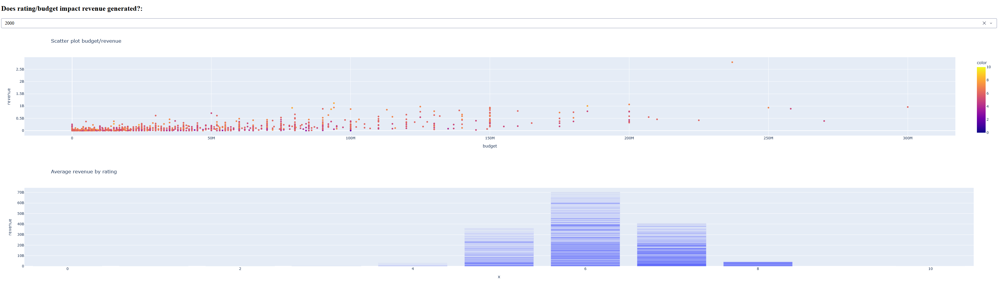

# Movie Data Visualization Project:
This analysis explores the central business question: How do budget, rating, and
popularity correlate with movie revenue? Using a comprehensive movie dataset, we
examine patterns across financial investment, audience reception, and market
performance. The goal is to uncover meaningful relationships that can inform
production, marketing, and distribution strategies in the film industry.

# Created Interactive Business Dashboard:

# Dataset Description:
- budget: int64, "cost to make the movie." (will use)
- genres: object, "genre names of movie. Messy values" (no use)
- homepage: object, "homepage url for each movie." (will not use)
- id: int64, "primary key for each movie" (will not use)
- keywords: object, "common words to describe/said in the movie. Messy values" (will not use)
- original_language: object, "original language the movie was created for" (will use)
- original_title: object, "original title the movie had before release" (will not use)
- overview: object, "about/description of the movie" (will not use)
- popularity: float64, "metric of the overall movie popularity (viewership)" (will use)
- production_companies: object, "the production companies involved with the movie. Messy values" (will not use)
- production_countries: object, "the countries involved with the production of the movie. Messy values" (will not use)
- release_date: object, "object, "date the movie was released. May change to datetime type." (will use)
- runtime: int64, "total time in minutes the movie lasts" (will use)
- spoken_languages: object, "languages spoken in the movie. Messy values. (will not use)
- status: object, "release status of each movie. (will use)
- tagline: object, "movie slogan. (will not use)
- title: object, "title for each movie (will use)
- vote_average: float64, "vote average for the movie score. (will use)
- vote_count: int64, "the total score/review for each movie. (will use)

